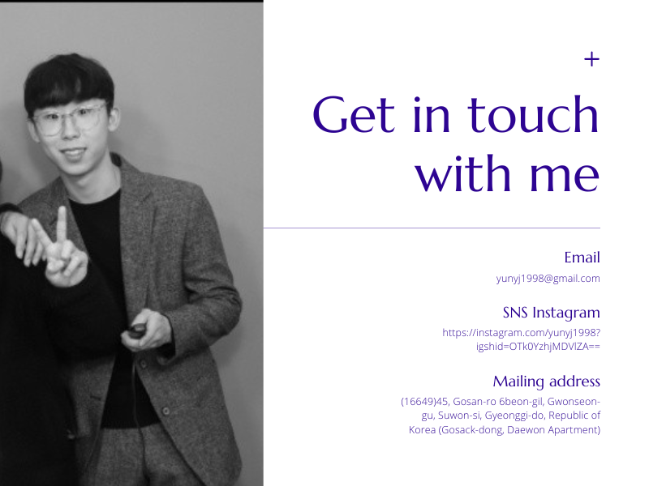

 

  <samp>
    Hi, I'm Saad! 👋  
    🔥 Software Developer grinding hard to make something cool   
    :sparkles: Favorite Tech: JavaScript, React, Typescript, Python ...  
    :email:	saadpasta70@gmail.com  
    :art: Portfolio: https://saadpasta.github.io  
                Twitter: https://twitter.com/saadpastadev?lang=en 
  :briefcase: Building https://www.refactornow.dev/ - Learn the Art of Refactoring  

  </samp>

# 포트폴리오-YJ

## 윤용준

[👩‍💻 Notion 포트폴리오](https://www.notion.so/MR-_YUN-100d23b1a85b42d2b9e29262f02e9011)

#### 데이터 분석가

- **1998.12.29**
- 이메일: yunyj1998@gmail.com
- GitHub: [yunyj1998](https://github.com/yunyj1998)
- 블로그: [네이버 블로그 - yunyj1998](https://blog.naver.com/yunyj1998)

> 세심한 개발자
>
> 빈 공간을 메우는 개발자
>
> 사람들이 필요로 하는 것을 생각하는 개발자

## 목차

1. [활동 요약](#활동-요약)
    - 1-1. [교육](#교육)
    - 1-2. [Kaggle 경진대회](#Kaggle-Contest-Store-Sales)
2. [프로젝트 요약](#프로젝트-요약)
    - 2-1. [2023](#2023)
3. [프로젝트 상세](#프로젝트-상세)
    - 3-1. [데이터 분석 - 청소년 범죄](#데이터-분석-청소년-범죄)
    - 3-2. [데이터 분석 - 가상 회사](#데이터-분석-가상-회사)
    - 3-3. [데이터 분석 - 매장 판매](#데이터-분석-매장-판매)
    - 3-4. [개인 프로젝트 - 자체 인공지능 생성](#개인-프로젝트-자체-인공지능-생성)
